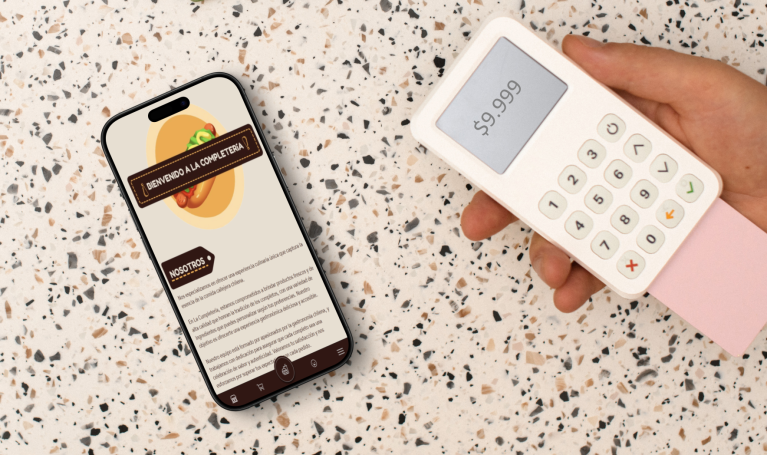
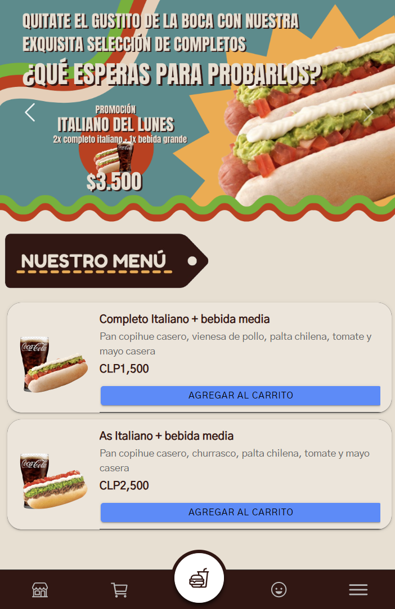
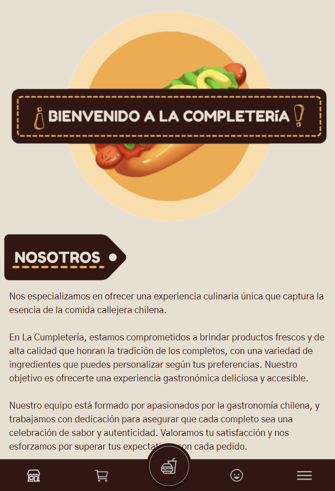
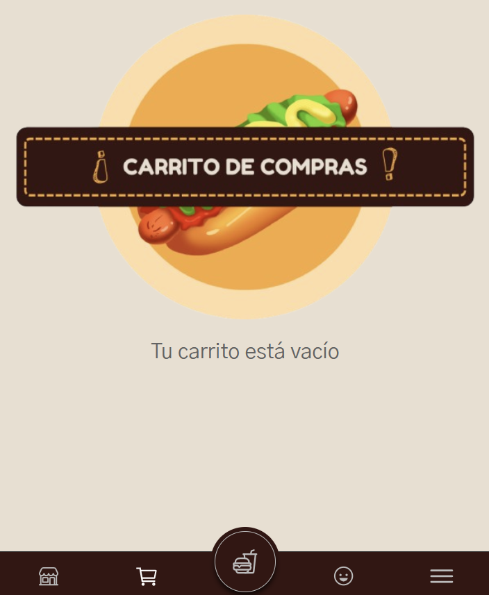
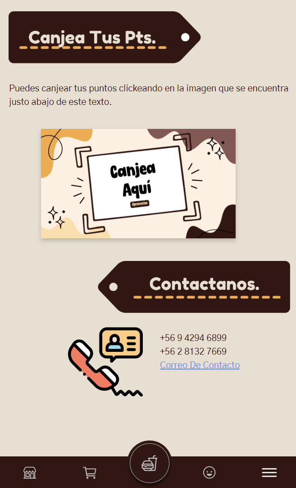

<p align="center">
    
</p>

<div align="center">

# App Completos

[](https://ionicframework.com/docs/angular/overview)

</div>

<p align="center">
  Aplicación mobile para vender completos.
</p>

<p align="center">
    
</p>

## Instalación

Clona el repositorio e ingresa a la carpeta

``` bash
git clone https://github.com/Marfullsen/PR-appCompletos.git appCompletos
cd appCompletos
```

Instala las dependencias necesarias

``` bash
npm install
```

Inicia el servidor de desarrollo de Ionic

``` bash
npm start
```

Deberías automáticamente ser redirigido al sitio web, de no ser así ve al sitio que se indique en la consola, por defecto es:

[http://localhost:4200/]()

## Capturas de pantalla

<p align="center">
    
</p>

<p align="center">
    
</p>

<p align="center">
    
</p>

<p align="center">
    
</p>

## Referencias

- pancho iconos - Pancho iconos creados por [Freepik - Flaticon](https://www.flaticon.es/iconos-gratis/pancho)
- Mockup banner por [mockuuups.studio](https://mockuuups.studio/collection/free-smartphone-mockup-with-credit-card-terminal/)
- Repo original por cacot12 - [appCompletos](https://github.com/cacot12/appCompletos)